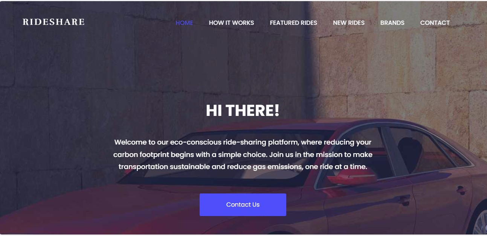

# RideShare - Sustainable Ridesharing Platform

## Overview
RideShare is not just another ridesharing platform; it's a commitment to a greener and more sustainable future. Our mission is to reduce carbon emissions by promoting carpooling, optimizing transportation resources, and contributing to the United Nations Sustainable Development Goals (SDGs).

	
## Features

### 1.**Smart Ridesharing**
   - Connect with eco-conscious riders and drivers in your area.
   - Efficient route planning for reduced travel time and emissions.

### 2.**Climate-Focused**
   - Every shared ride is a step towards combating climate change.
   - Real-time carbon footprint tracking to visualize your positive impact.

### 3.**SDG Integration**
   - Aligning with UN SDGs, particularly Goal 13 (Climate Action) and Goal 11 (Sustainable Cities).
   - Contributing to a sustainable and responsible community.

## About Us

At RideShare, we believe in the power of collective action. By choosing shared transportation, you're not just saving money; you're making a conscious choice for the planet. Our About Us page delves into our commitment to environmental stewardship and the specific SDGs we actively support.

## How It Works

### Step 1: Join our newsletter
   - Create your RideShare account to access our eco-friendly ridesharing community.

### Step 2: Find Your Ride
   - Input your destination, and RideShare will connect you with compatible rides in real-time.

### Step 3: Share the Ride
   - Enjoy a sustainable journey with like-minded individuals, contributing to a greener planet.

## Get Involved

### Partner with Us
   - Are you a green-conscious business or organization? Join us in our mission.

### Spread the Word
   - Share RideShare with your community and help us grow our network.